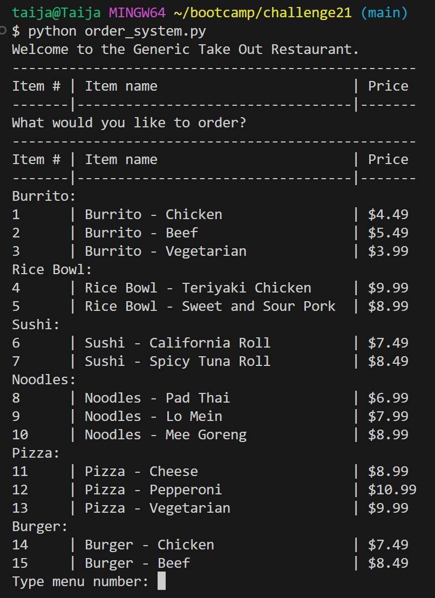
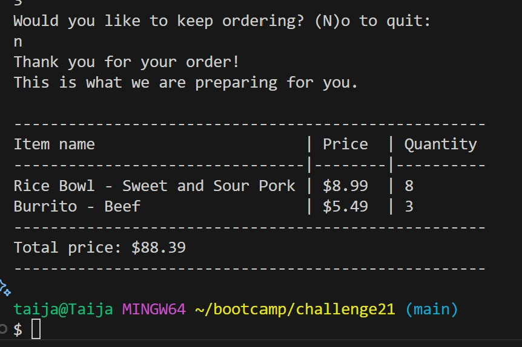

# 🍽️ Restaurant Menu & Ordering System

## 📑 Table of Contents
- [Description](#description)
- [Screenshots](#screenshots)
- [Installation](#installation)
- [Usage](#usage)
- [Features](#features)
- [License](#license)
- [Contributing](#contributing)
- [Tests](#tests)
- [Project Links](#project-links)
- [Questions](#questions)

## 📖 Description
This Python application simulates a takeout restaurant ordering system in the terminal. Users can:

 - View a full categorized menu

- Select items by number

- Specify quantities (with a default of 1 if no input)

- Repeat the ordering process until they’re done

- Receive a formatted receipt showing all items, prices, and total cost

## 📸 Screenshots

Here are some previews of the program in action:

### 📋 Menu Display

### 🧾 Receipt Output

## 💾 Installation
1. Clone the repo: `git clone`: https://github.com/taijamartinez/RestaurantMenu-OrderSystem  
then `cd RestaurantMenu-OrderSystem`.

2. Run the script:  
`python order_system.py`

## 🚀 Usage

Follow the prompts in your terminal:

- View the menu

- Type the item number to order

- Enter the quantity (or press enter to default to 1)

- Type n when done ordering

- Review your itemized receipt

## ✨ Features

- Categorized, dynamic menu

- Input validation for item selection and quantity

- Flexible ordering loop

- Receipt formatting with calculated totals

- Pythonic use of functions and data structures

## 📜 License

This application is covered under the MIT license.

## 🤝 Contributing

If you would like to contribute to my project please follow these steps!

1. Fork the repository on GitHub.
2. Clone your fork to your computer.
3. Create a new branch for your changes.
4. Make your changes and commit them using descriptive messages.
5. Push your branch and open a pull request!

## 🧪 Tests

Basic test functionality includes:

- Selecting a valid menu item

- Handling invalid inputs (letters, out-of-range numbers)

- Defaulting quantity to 1 when not provided

- Ending ordering and displaying correct totals

## 🔗 Project Links

Repository: https://github.com/taijamartinez/RestaurantMenu-OrderSystem

## ❓ Questions

Please reach me here with additional questions:

GitHub: https://github.com/taijamartinez  
Email: taijasmartinez@gmail.com 

Happy coding! 🚀 
